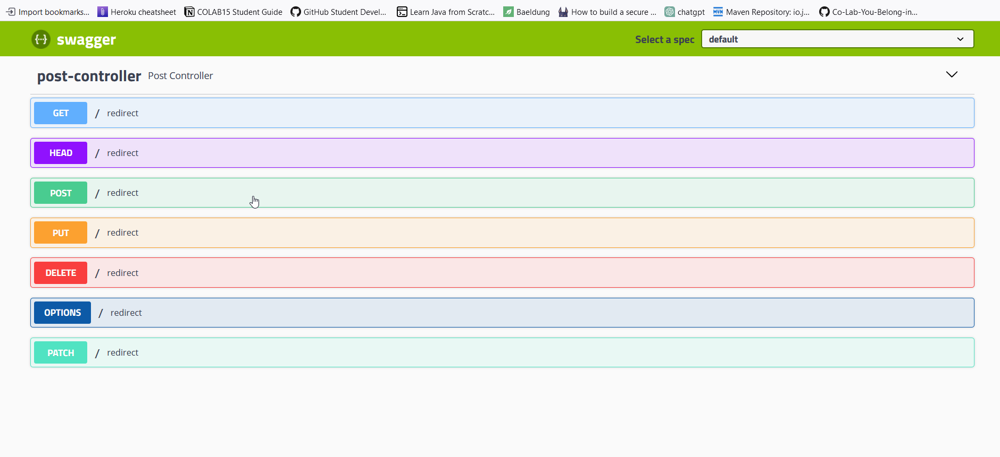
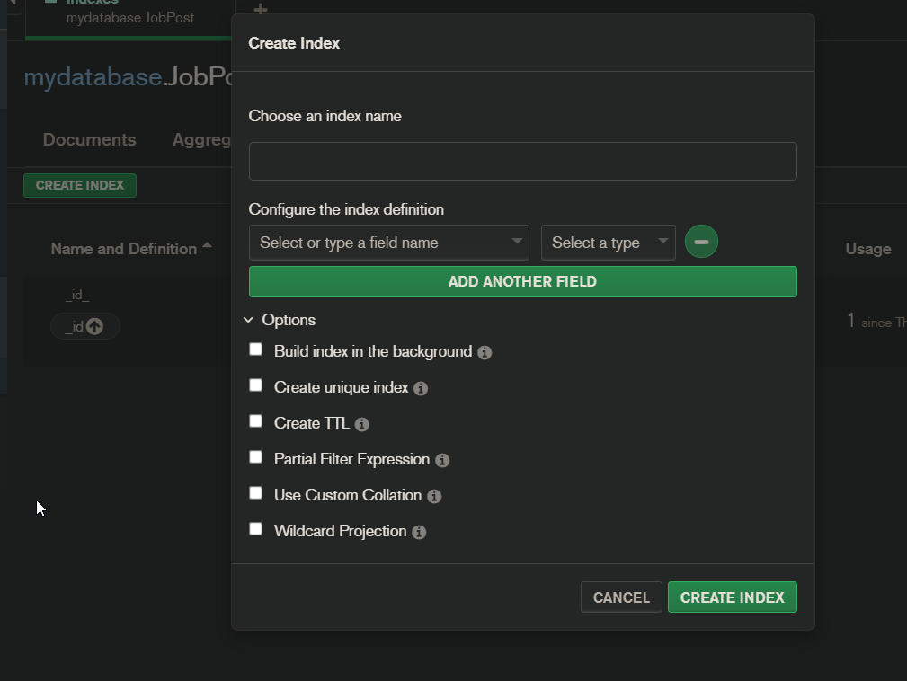

##### To make swagger work
use spring boot version 2.5.7 


#### Add swagger to pom.xml
```xml
<dependency>
    <groupId>io.springfox</groupId>
    <artifactId>springfox-swagger2</artifactId>
    <version>2.9.2</version>
</dependency>

<dependency>
    <groupId>io.springfox</groupId>
    <artifactId>springfox-swagger-ui</artifactId>
    <version>2.9.2</version>
</dependency>
```


#### Add swagger configuration to your main class
```java
package com.abcode.joblist;

import org.springframework.boot.SpringApplication;
import org.springframework.boot.autoconfigure.SpringBootApplication;
import org.springframework.context.annotation.Bean;
import org.springframework.web.bind.annotation.RestController;
import springfox.documentation.builders.ApiInfoBuilder;
import springfox.documentation.builders.PathSelectors;
import springfox.documentation.builders.RequestHandlerSelectors;
import springfox.documentation.service.ApiInfo;
import springfox.documentation.spi.DocumentationType;
import springfox.documentation.spring.web.plugins.Docket;
import springfox.documentation.swagger2.annotations.EnableSwagger2;

@SpringBootApplication
@EnableSwagger2
public class JoblistApplication {

	@Bean // this bean is used to create a new instance of the class
	public Docket api() {
		return new Docket(DocumentationType.SWAGGER_2)
				.select()
				.apis(RequestHandlerSelectors.withClassAnnotation(RestController.class))
				.paths(PathSelectors.any())
				.build().apiInfo(apiInfo()).useDefaultResponseMessages(false);
	}

	private ApiInfo apiInfo() {
		final ApiInfoBuilder builder = new ApiInfoBuilder();
		return builder
				.title("Joblist API")
				.description("API for Joblist")
				.version("1.0.0")
				.build();
	}

	public static void main(String[] args) {
		SpringApplication.run(JoblistApplication.class, args);
	}

}
```

#### Add swagger configuration to your controller
```java
package com.abcode.joblist;

import jakarta.servlet.http.HttpServletResponse;
import org.springframework.web.bind.annotation.RequestMapping;
import org.springframework.web.bind.annotation.RestController;

import java.io.IOException;

@RestController
public class PostController {

    @RequestMapping(value = "/") // if the user types in the root of the application, it will redirect to the swagger page
    public void redirect(HttpServletResponse response) throws IOException {
        response.sendRedirect("/swagger-ui.html");
    }

}
```

#### Run the application and go to http://localhost:8080
You should see the swagger page


To remove the /redirect endpoint, you can add the following to your controller
```java
package com.abcode.joblist;

import org.springframework.web.bind.annotation.RequestMapping;
import org.springframework.web.bind.annotation.RestController;
import springfox.documentation.annotations.ApiIgnore;

import javax.servlet.http.HttpServletResponse;
import java.io.IOException;

@RestController
public class PostController {

    @ApiIgnore // this annotation will ignore the endpoint
    @RequestMapping(value = "/") // if the user types in the root of the application, it will redirect to the swagger page
    public void redirect(HttpServletResponse response) throws IOException {
        response.sendRedirect("/swagger-ui.html");
    }

}

```


---

### What is POJO
POJO stands for Plain Old Java Object. It is a Java object that is not bound by any restriction other than those forced by the Java Language Specification. It is not an Entity or a DTO.


---

#### To enable indexing in your mongodb database in order access the mongo atlas search 



